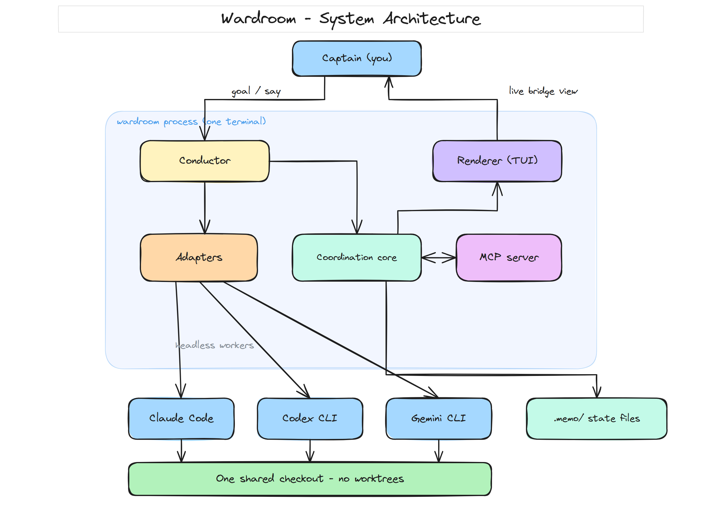
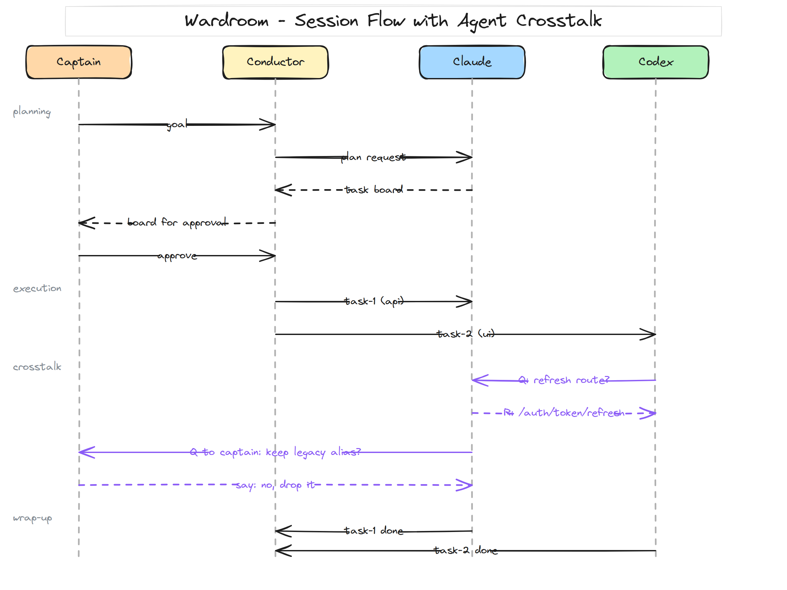
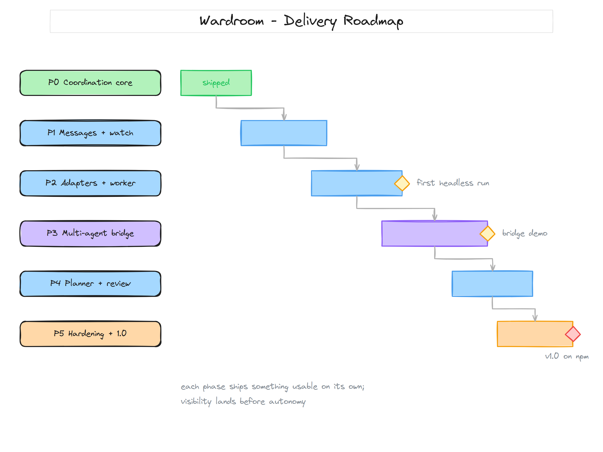

# wardroom

One terminal harness for parallel AI coding agents on one checkout.

Claude Code, Codex, and Gemini CLI plan together, talk to each other, and
build simultaneously in the same working tree. No worktrees. No merge
conflicts. You watch the whole crew from a single terminal and steer it.


The wardroom is the room on a warship where officers meet, plan, and
coordinate the running of the ship. One ship, one crew, one table.

---

## Why this exists

The standard answer to parallel coding agents is isolation: a git worktree,
branch, or container per agent. That works only when tasks have clean
separation of concerns. The moment tasks touch overlapping files, isolation
does not prevent the conflict — it defers it to merge time, where context is
worst. Empirical studies of agent-authored pull requests put merge-conflict
rates at 27 to 42 percent for co-active work, and the standard remedy is a
human merging branches one at a time — re-serializing the parallelism by
hand.

Subagents inside a single tool do not solve it either: isolated contexts, no
agent-to-agent communication, results funneled through one orchestrator, and
roughly 15x token cost. They are a map-reduce over reads, not a team of
writers.

Wardroom takes the third path: a shared checkout with real coordination.
Conflicts are prevented before the edit instead of merged after. The full
research with sources is in [docs/parallelism.md](docs/parallelism.md).

## How it works



Three layers, all state in plain files under `.memo/` in your repo:

1. **Coordination core** (shipped). A dependency-aware task board where
   every task declares the files it will touch; `claim_next_task` atomically
   hands an agent the next task whose dependencies are done and whose files
   nobody else holds, then leases those files. Advisory TTL file leases for
   ad-hoc edits. A cursor-pollable event bus for broadcasts. Disjoint tasks
   run truly in parallel; colliding tasks serialize automatically.

2. **Memory** (shipped). Structured session writedowns captured on demand;
   `AGENTS.md` is regenerated as the cold-start index every agent reads
   first. A fresh session resumes where the last one stopped.

3. **The harness** (in development, see the plan). A single `wardroom` CLI
   that spawns each agent CLI as a headless worker, gives agents directed
   messaging so they can ask each other questions and announce changes, and
   renders everything live in one terminal: the board, each agent's work
   stream, and the crosstalk between them.



## Current state

Today wardroom is the coordination core plus memory, exposed as an MCP
server that Claude Code, Codex, and Gemini CLI connect to from their own
terminals. The single-terminal harness is being built on top of it — the
full product plan, architecture, and phased delivery with acceptance
criteria is in [docs/plan.md](docs/plan.md).



## Tools (MCP surface)

| Tool | Purpose |
|------|---------|
| `get_context` | One call: latest writedown, task board, claims, recent events |
| `plan_tasks` | Create tasks with file footprints and dependencies |
| `claim_next_task` | Atomically pull the next runnable, non-conflicting task |
| `complete_task` / `fail_task` / `release_task` | Finish or return work; releases leases |
| `get_board` | Render the full task board |
| `claim_files` / `release_files` / `check_files` | Advisory TTL file leases |
| `post_event` / `get_events` | Broadcast and cursor-poll the shared event stream |
| `write_session` / `read_memo` | Durable session writedowns |

## Install and wire

```bash
npm install -g wardroom    # or npx wardroom
```

Register the MCP server in each CLI (Claude Code `.claude/settings.json`,
Codex `~/.codex/config.json`, Gemini `~/.gemini/settings.json`):

```json
{
  "mcpServers": {
    "wardroom": { "command": "npx", "args": ["wardroom"] }
  }
}
```

Copy `CLAUDE.md` and `GEMINI.md` from this repo into your project root;
Codex reads the generated `AGENTS.md` natively. Full wiring, including the
optional cold-start injection hook, is in [docs/setup.md](docs/setup.md).

## Documentation

| Document | Contents |
|----------|----------|
| [docs/plan.md](docs/plan.md) | Product plan: vision, harness architecture, phases, acceptance criteria, risks |
| [docs/parallelism.md](docs/parallelism.md) | Research: worktrees vs subagents vs shared-checkout coordination, with sources |
| [docs/architecture.md](docs/architecture.md) | Coordination core internals: subsystems, on-disk layout, concurrency design |
| [docs/protocol.md](docs/protocol.md) | The rules agents follow on a shared checkout |
| [docs/setup.md](docs/setup.md) | Wiring guide for each CLI |

## Development

```bash
git clone https://github.com/kedarvartak/wardroom
cd wardroom
npm install

npm run build   # compile TypeScript to dist/
npm test        # Node 22 native test runner, incl. multi-process concurrency tests
npm start       # start the MCP server over stdio
```

## License

MIT
